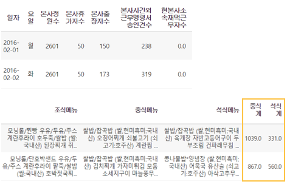
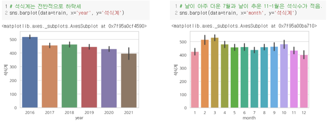
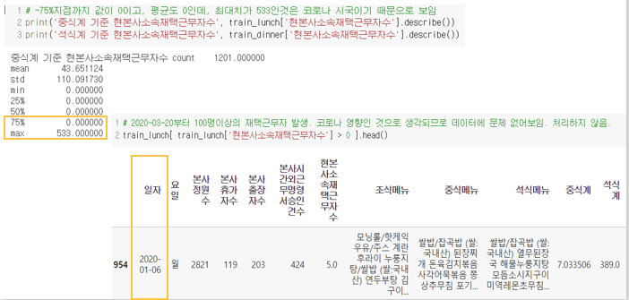
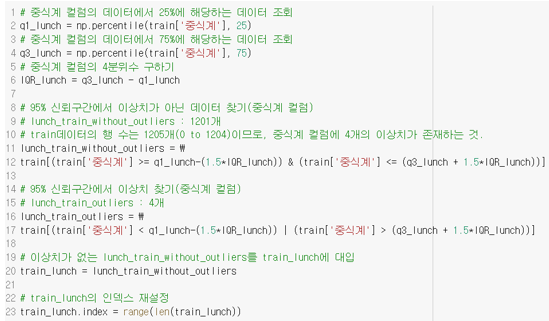
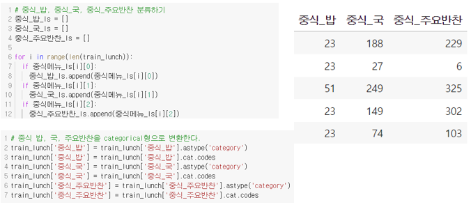
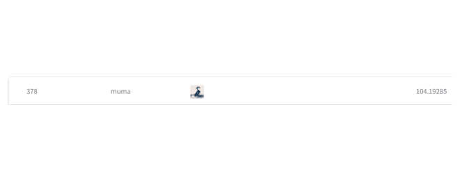

# [DYCON] 구내식당 식수 인원 예측

> 프로젝트 설명

- 구내식당 이용객 수를 예측하는 대회
- 머신러닝 방식 적용

## 1. 컬럼 소개

## 2. 데이터 전처리

- 컬럼별 특성 파악

## 3. 이상치 제거

## 4. 필요 컬럼 추가

## 5. 알고리즘

- Decision Tree
- Random Forest
- XGBoost
- Light BGM
- KNN (K Nearest Neighbors)
- Logistic Regression
- Linear Regression
- Polynomial Regression
- Ridge
- Lasso
- Elastic Net

## 7. 결론 및 고찰

- 제출 결과, Decision Tree를 이용한 예측이, 378등으로 가장 등수가 높았음

- 대회제출을 위한 test데이터를 이용할 때, 전처리과정을 동일하게 밟았고,예측값이 로그로 나오기 때문에, 지수함수를 이용한 후에, 제출함

  그리고나서, 데이터를 정규화할 때, Log0은 음의 무한대이므로, 파이썬 오류를 방지하기 위해서 Log를 취한 후에 1을 더해 주었기 때문에, 모델의 예측값을 지수함수에 대입하고, 1을 더한 값을 제출함

- 데이터 처리를 잘못한 부분이 있어서 인지 등수가 높게 나오지는 않았음 고민이 필요함

