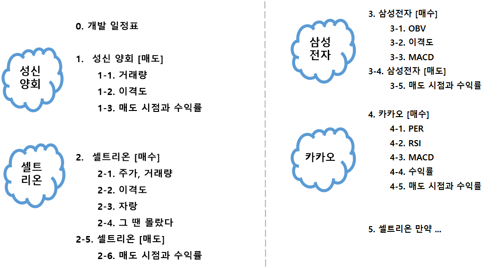

# 2018년 데이터 분석에 기반한 주식 매매

> 프로젝트 설명

- 주식 종목 선택 시 상승세, 하락세 확인 하는 방법

<<<<<<< HEAD:모듈_프로젝트02/Readme.md
=======

>>>>>>> 2a41240f6ab8aeeff9629adb937d55f9bf76136d:모듈_프로젝트02/REAEME.md
---

## 

- 유명한 변동 보조 지표를 활용

